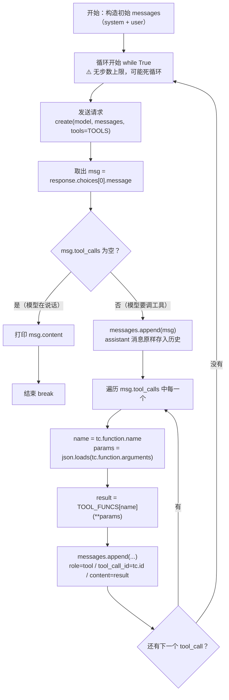

# Agent 工具调用最小示例
手写 Agent 循环，不使用任何 Agent 框架。

## 前置条件
Python314
DeepSeek API key 可以去deepseek开放平台获取

## 配置
1. 复制 `.env.example` 为 `.env`
2. 在 `.env` 里填入你的 key

## 运行
1. 创建并激活虚拟环境
2. python -m pip install -r requirements.txt
3. python agent.py

## 项目说明
`tools.py` —— 工具函数 + 它们的 schema
`agent.py` —— Agent 循环

## 调用流程图

## 我踩的坑
1. get_weather 的 properties 写了 expression、required 写了 city 报错信息会没任何提示 所以要注意细节 尽量避免此类问题
2. isinstance(expression, float) 判断错了对象 参数填写错误 会导致判断不生效

## 已知缺陷
循环没有步数上限，模型反复要求同一工具时会死循环（W3 修复）
工具执行失败会直接抛异常中断，错误没有回灌给模型（W3 修复）