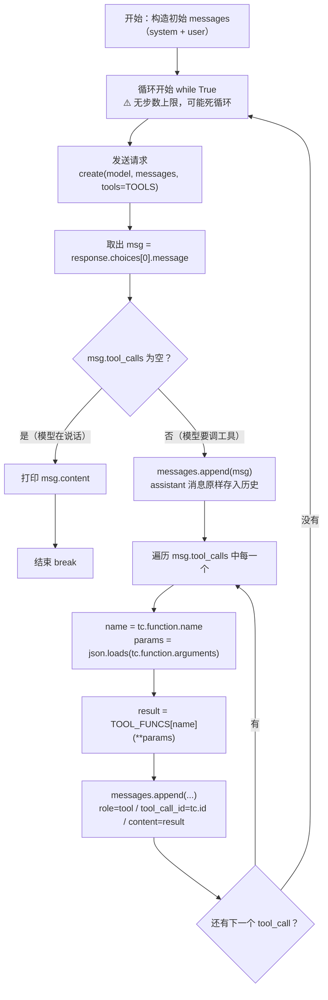
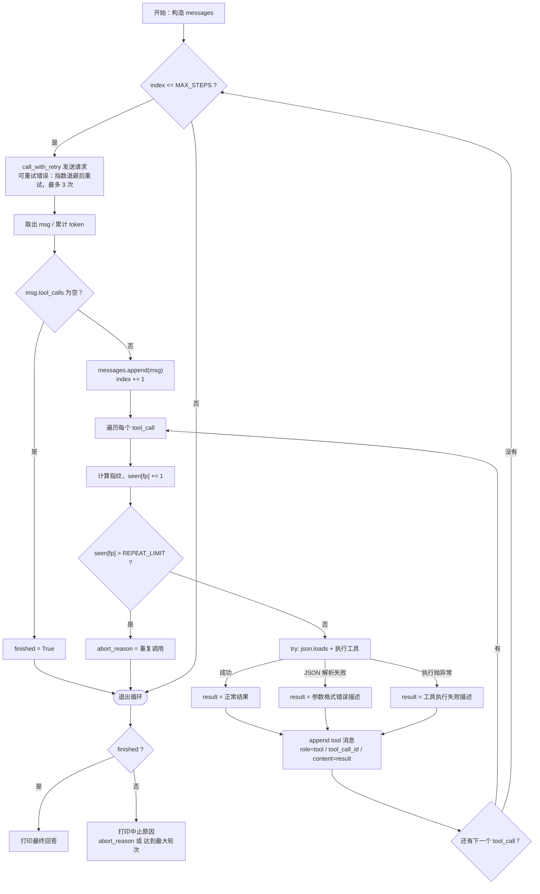

# WEEK1 ✅
## DeepSeek API 最小调用示例
代码练习，先照着官方文档跑通，再关掉文档重写

### 前置条件
- Python314
- DeepSeek API key 可以去deepseek开放平台获取

### 配置
1. 复制 `.env.example` 为 `.env`
2. 在 `.env` 里填入你的 key

### 运行
1. 创建并激活虚拟环境
2. 安装依赖
python -m pip install -r requirements.txt
3. 运行脚本
python sdk_call.py
python HTTP_call.py

### 项目说明
- `sdk_call.py` —— 用 openai SDK 调用
- `HTTP_call.py` —— 用 requests 手写 HTTP 调用
SDK版本相当于给HTTP版本封包 HTTP版本会展示更多底层的细节 所以要写两个版本

### 我踩的坑
1. 在全局环境运行正常 在虚拟环境会报错 是因为虚拟环境少一些包 安装好后问题就会解决
2. git报dubious ownership 是因为.git属主和管理员权限不一致，Git拒绝操作 只需要把当前文件目录添加进安全目录里问题就会解决
3. requirements.txt编码变成UTF-16 可能会导致报错 是因为我电脑自带的PowerShell版本是老版本 可以cmd执行命令解决

# WEEK2 ✅
## Agent 工具调用最小示例
手写 Agent 循环，不使用任何 Agent 框架。

### 前置条件
Python314
DeepSeek API key 可以去deepseek开放平台获取

### 配置
1. 复制 `.env.example` 为 `.env`
2. 在 `.env` 里填入你的 key

### 运行
1. 创建并激活虚拟环境
2. python -m pip install -r requirements.txt
3. python agent.py

### 项目说明
`tools.py` —— 工具函数 + 它们的 schema
`agent.py` —— Agent 循环

### 调用流程图

### 我踩的坑
1. get_weather 的 properties 写了 expression、required 写了 city 报错信息会没任何提示 所以要注意细节 尽量避免此类问题
2. isinstance(expression, float) 判断错了对象 参数填写错误 会导致判断不生效

### 已知缺陷
循环没有步数上限，模型反复要求同一工具时会死循环（W3 修复）
工具执行失败会直接抛异常中断，错误没有回灌给模型（W3 修复）

# WEEK3 ✅
## 健壮性：让 Agent 在异常情况下不崩、且能自我纠正
### 概述
W2中遗留了两个问题
没有设步数上限，模型反复要求同一工具时会死循环
工具执行失败会直接抛异常中断，错误没有回灌给模型
W3解决了这两个问题并加了幂次判定 防止计算时间过长导致程序卡死

### 新增能力
步数上限 —— 最多10轮，超限明确告知用户
重复调用检测 —— 同一"工具+参数"指纹允许2次，第3次中止
错误回灌 —— 工具执行失败/参数JSON解析失败，都把失败描述作为tool结果回灌
请求重试 —— 针对连接错误/429/5xx，最多3次尝试，指数退避+随机抖动
超时 —— 请求30秒
结构化日志 —— 按轮次记录工具名、参数、结果、token
成本统计 —— 累计token用量
输入防护 —— calculate禁用幂运算，防止天文数字运算卡死

### 调用流程图（更新版）

### 关键设计决策
步数上限设置为10轮，确保用户等待时间不会过长，且能基本确保是模型出现了死循环
工具执行失败后会向模型发送错误信息，确保模型能根据错误信息判断下一步的执行方式
增加了幂次判定，确保计算时间不会过长

### 我踩的坑
1. 在代码设计初期，跳出循环的判断出了问题，工具调用失败时进行了break，会导致assistant消息有tool_calls但缺tool响应，下一次请求会被服务端拒绝
2. json.loads没有加try，导致模型在回报出问题的json时程序会崩溃

### 已知限制
幂次判定的增加虽然保证了计算时间不会太长，但会导致无法进行简单幂次计算，后期会增加判定器来解决
无持久化，程序结束历史就丢失（W5）
无上下文压缩，长对话会持续增长（W10）